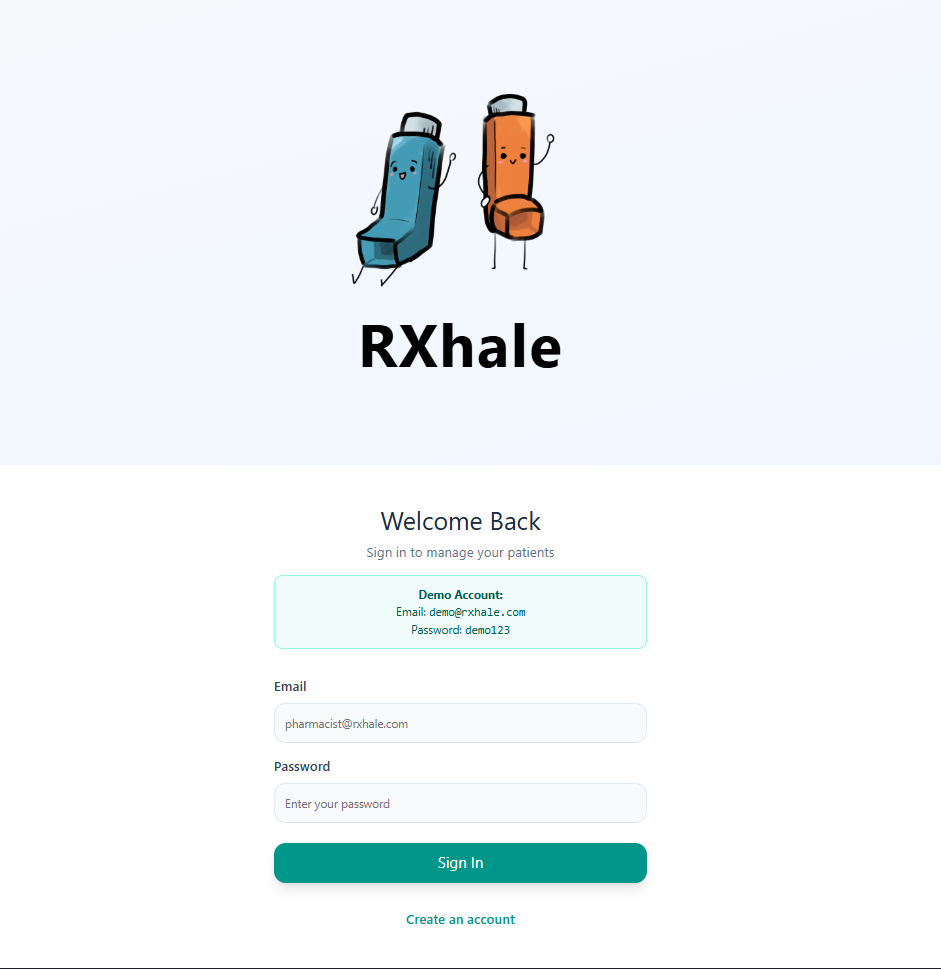
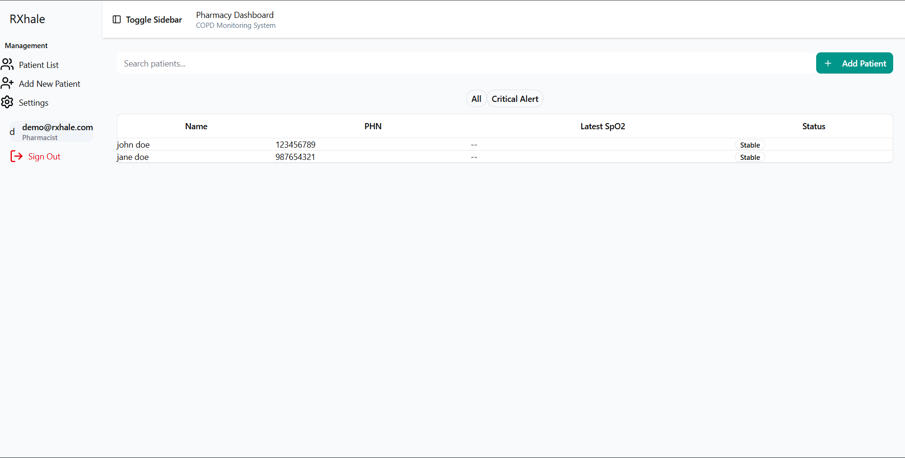
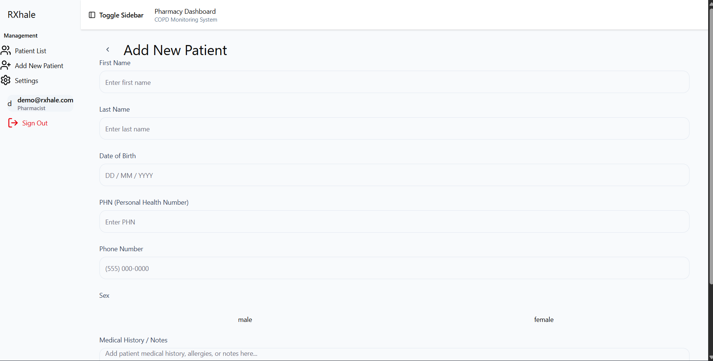

# RXhale Pharmacist Website
This the second part to a two part digital system. This web dashboard is intended for pharmacists to gain insight to their patient’s health, which takes relevant data from the patient’s mobile app in order to streamline pharmacy to patient connection. Key features of this web dashboard include trend visualizations, automated risk flags if patients trends deviate too far from their baseline, medication adherence (in case of missed dose or increased dose), and patient symptoms. It also allows pharmacists to log notes from their patient’s visits and provide direct communication to the patient and/or their doctor.

## Languages/Libraries/Tools Used
* TypeScript
* React
* Firebase

## Contributors
* [CJ Butler](www.linkedin.com/in/cecilbutler)
* [Connie (Nguyen) Le]](https://www.linkedin.com/in/connie-le-a0267a349/)
* [Sidney Le](https://www.linkedin.com/in/sidney-le-125353297/)
* [Chloe Chung](https://www.linkedin.com/in/chung-chloe/)
* [Ibrahim Tazkarji](https://www.linkedin.com/in/ibrahim-tazkarji-7b9006197/)
